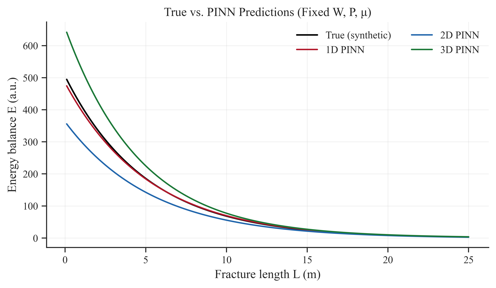
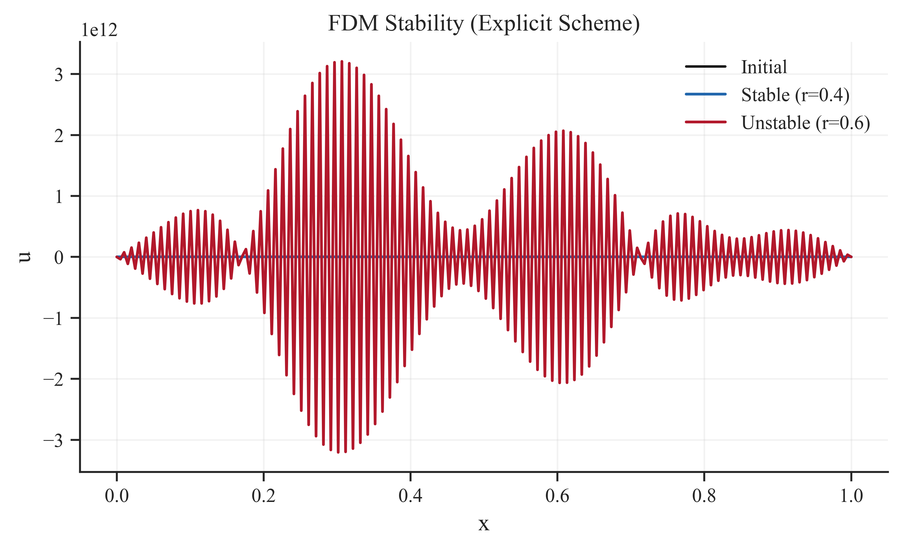

[](https://opensource.org/licenses/MIT)


# Physics-Informed Neural Networks Modeling of Energy-Balance Proxies for Hydraulic Fracture Propagation in 1D-3D

This repository provides a physics-guided PINN benchmark that learns a synthetic energy proxy
across 1D, 2D, and 3D input spaces. The setup is designed to study dimensional effects and
training stability rather than full PDE coupling.

## Energy proxy

$$
E = \frac{P W}{\mu} \exp\left(-\frac{L}{5}\right)
$$

where:
- `L` is fracture length (m)
- `W` is fracture width (m)
- `P` is pressure gradient (MPa/m)
- `mu` is viscosity (Pa*s)

Input cases:
- 1D: `L`
- 2D: `(L, W)` at fixed `P, mu`
- 3D: `(L, W, P, log(mu))`

## Featured results



Highlight: One slice across `L` at fixed `W, P, mu` shows how 1D/2D/3D PINNs track the synthetic target.



Highlight: A compact stability contrasts stable vs. unstable explicit steps, underscoring why training dynamics can diverge.

## Quick start

```bash
python pinn_fracenergy.py
```

Outputs (plots and tables) are written to `Figures/`. Edit `pinn_fracenergy_config.py` to
change dataset size, training schedule, and 3D sweep options.

## Results (test set, default config)

| Model | MSE | NRMSE | R^2 |
|---|---:|---:|---:|
| 1D PINN | 21.5262 | 0.0371 | 0.9986 |
| 2D PINN | 1747.4936 | 0.2389 | 0.9429 |
| 3D PINN | 11417.2359 | 0.0939 | 0.9912 |

## Outputs

Key figures produced by `pinn_fracenergy_plots.py`:

- `Figures/comparison.png`
- `Figures/fdm_instability.png`
- `Figures/trainloss.png`
- `Figures/contour_map.png`
- `Figures/3D_surface.png`
- `Figures/error_distribution.png`
- `Figures/kgd_baseline.png`

## Repo layout

- `pinn_fracenergy.py`: main training/evaluation entrypoint
- `pinn_fracenergy_config.py`: experiment configuration
- `pinn_fracenergy_data.py`: synthetic data generation and scaling
- `pinn_fracenergy_model.py`: model construction, training, metrics
- `pinn_fracenergy_plots.py`: plotting utilities
- `Figures/`: generated plots (created on run)
- `README.md`, `LICENSE`

## Citation

If you use this work, please cite the accompanying manuscript.

## Funders

- The National Key R&D Program of China (2023YFE0110900)
- National Natural Science Foundation of China (52074040)
- Nazarbayev University’s Collaborative Research Project (111024CRP2014)
